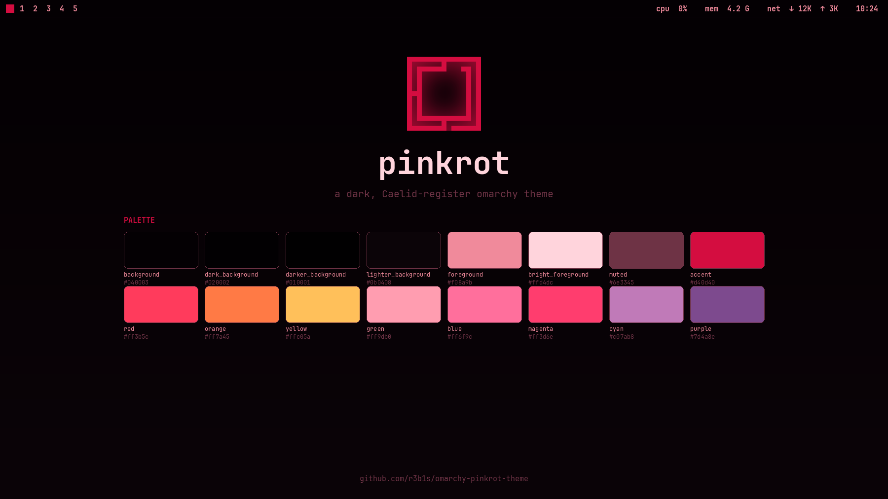

# Omarchy pinkrot theme

pinkrot is a dark, near-black theme in the Caelid register: scarlet, ember and
gold over a red-tinted void, with pink chrome and bruised purples for contrast.
It is the Omarchy port of the `pinkrot` theme from
[athena-dots](https://github.com/r3b1s/athena-dots), re-tuned so the accents
stay on the pink-red spectrum.

## Preview



## Install

```bash
omarchy theme install https://github.com/r3b1s/omarchy-pinkrot-theme
```

The repo is named `omarchy-pinkrot-theme`, so it installs as **pinkrot** and
appears as *Pinkrot* in the theme switcher.

## Palette

`colors.toml` is the source of truth. There is deliberately **no green, blue,
teal or brown** — every role is a red/gold, a pink, or a purple, and the
background is darker than the original to keep text off its backdrop.

| Role | Key | Value | Reads as |
| --- | --- | --- | --- |
| Accent | `accent` | `#d40d40` | crimson |
| Selection | `selection` / `selection_foreground` | `#d40d40` / `#180107` | crimson / near-black |
| Background | `background` | `#040003` | near-black red |
| Surface | `lighter_background` | `#0b0408` | dark plum |
| Foreground | `foreground` | `#f08a9b` | warm pink |
| Bright foreground | `bright_foreground` | `#ffd4dc` | bone pink |
| Muted | `muted` | `#6e3345` | dusky maroon |
| Red | `red` | `#ff3b5c` | scarlet |
| Orange | `orange` | `#ff7a45` | ember |
| Yellow | `yellow` | `#ffc05a` | gold |
| "Green" | `green` | `#ff9db0` | soft rose (strings, success) |
| "Blue" | `blue` | `#ff6f9c` | hot rose (functions, directories) |
| Magenta | `magenta` | `#ff3d6e` | hot pink (keywords) |
| "Cyan" | `cyan` | `#c07ab8` | dusky orchid (links, the prompt) |
| Purple | `purple` | `#7d4a8e` | bruise |
| "Brown" | `brown` | `#5a1f3a` | deep plum |

The names in quotes keep their ANSI slots but not their hues, so tools that
reach for `green`/`blue`/`cyan` land back inside the pink-red-purple family.
Window borders (`hyprland_active_border`) run crimson into bruise.

### Why the background is so dark

Chromium derives a full Material-You palette from `chromium.theme`. The
original `#050007` background has a *blue*-dominant channel pair, so the
derived browser theme came out bright purple; a near-black red seed keeps the
browser in-family. The theme's darker background also lifts text off its
backdrop in TUIs that paint selection rows with an ANSI bright-black.

## What's included

| File | Purpose |
| --- | --- |
| `colors.toml` | The palette; drives every generated config |
| `backgrounds/` | `0-bleach.webp` plus the `omarchy.webp` fallback |
| `unlock.png` / `preview-unlock.png` | Lock screen art (Style > Unlock) |
| `preview.png` | Theme switcher preview |
| `btop.theme` | pinkrot btop colours |
| `chromium.theme` | Browser theme seed (`58,10,28`) |
| `icons.theme` | `Yaru-red` |
| `keyboard.rgb` | Keyboard backlight colour (`#d40d40`) |

No terminal config, Lua, or `vscode.json` is shipped. Omarchy regenerates those
from `colors.toml` anyway, and drops them from a theme installed out of a git
repo, so the repo only carries files that survive installation.

## Notes

- Additional wallpaper for this theme goes in
  `~/.config/omarchy/backgrounds/pinkrot/`; it is not tracked here.
